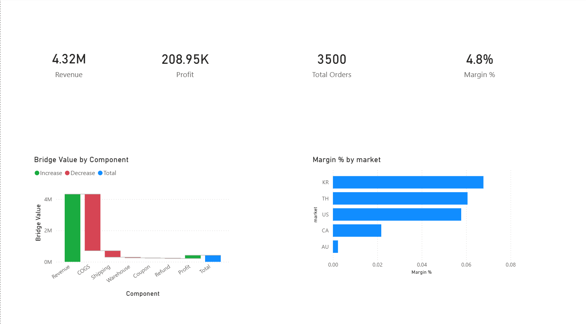
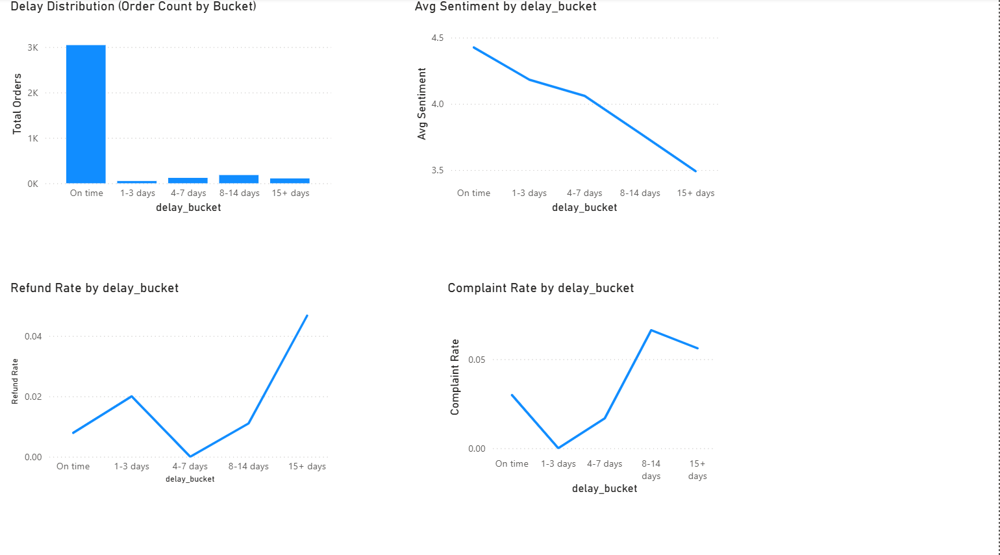
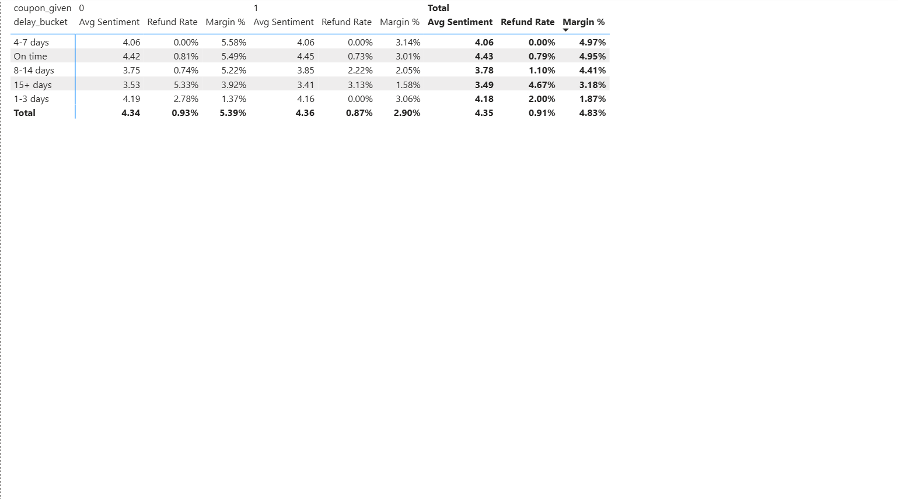
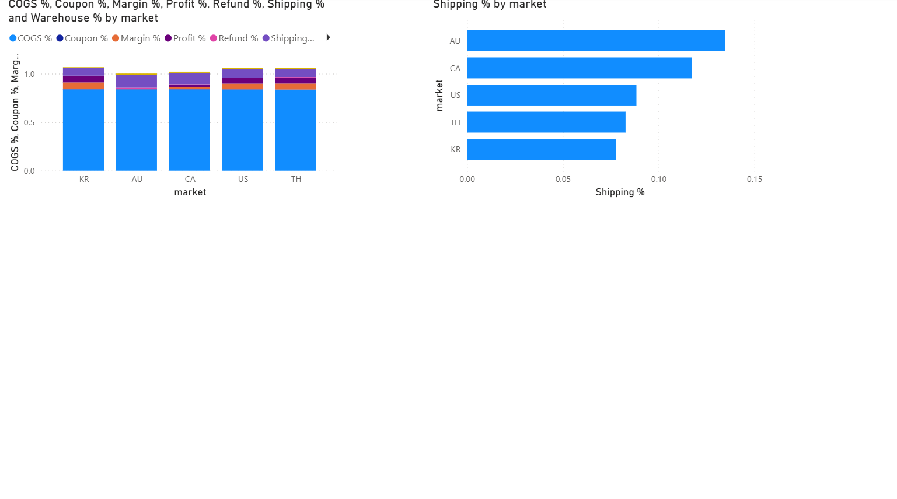

# Cross-Border E-commerce Operations & Margin Analysis

## Project Overview

This project analyzes a cross-border e-commerce order dataset to understand the drivers of profitability and operational risk.

The goal is not only to describe performance but to investigate:

- How delivery delays impact customer experience and financial outcomes
- Whether compensation mechanisms improve business results
- Why certain markets underperform structurally

The project combines **Python exploratory analysis** with **Power BI dashboards** to translate operational data into business insights.

---
Technical Focus

This project demonstrates practical experience in:

data processing with Python
data modelling and transformation
scenario simulation
dashboard development
iterative problem solving
building reproducible analysis workflows

---
# Dataset

The dataset contains **3,500 orders** across multiple sourcing markets.

Key variables include:

- selling price
- product cost (COGS)
- shipping cost
- warehouse cost
- coupon / compensation cost
- refund amount
- delivery delay
- sentiment score
- complaint flag

Key metrics:

| Metric | Value |
|------|------|
Revenue | 4.32M CNY  
Profit | 208K CNY  
Orders | 3,500  
Net Margin | ~4.8%

The business operates under **thin-margin cross-border retail conditions**, making cost structure and logistics efficiency critical.

---

# Analytical Journey

Rather than starting with fixed assumptions, the analysis followed an iterative investigation:

1. Profit structure analysis  
2. Delay impact on customer experience  
3. Financial risk from delays  
4. Market-level margin comparison  
5. Compensation effectiveness  
6. Structural evaluation of weak markets

Several early hypotheses were revised during the process.

---

# Profit Structure

A profit bridge analysis shows where revenue is consumed:

| Component | Share of Revenue |
|----------|------------------|
COGS | ~84%  
Shipping | ~9–10%  
Warehouse | ~1%  
Coupon | ~0.4%  
Gift | ~0.1%  
Refund | ~0.5%  
Profit | ~4.8%

### Key insight

Refunds and compensation represent **less than 1% of revenue**.

This means the business is **not primarily losing money through refunds**.  
Instead, margin is dominated by **COGS and logistics costs**.

---

# Delay Impact

Orders were grouped by delivery delay:

- On time
- 1–3 days
- 4–7 days
- 8–14 days
- 15+ days

### Customer Experience

Customer sentiment declines as delays increase:

- On time ≈ 4.4
- 1–3 days ≈ 4.2
- 4–7 days ≈ 4.1
- 8–14 days ≈ 3.8
- 15+ days ≈ 3.5

A clear **experience tipping point appears after ~7 days**.

### Financial Impact

Refund risk increases sharply for extreme delays:

- On time <1%
- 15+ days ≈ 4–5%

This indicates:

> Extreme delays are rare but financially significant.

---

# Market-Level Analysis

Margin varies significantly by market.

Some markets maintain stable margins, while others show structural weakness.

Australia initially appeared to be underperforming due to high logistics cost.  
However, deeper analysis showed that the issue cannot be explained by shipping alone.

Refund losses in Australia are small relative to COGS and shipping.

This indicates a broader **unit economics constraint** rather than a single operational failure.

---

# Compensation Analysis

Voucher-based compensation was evaluated to determine whether it reduces financial risk.

At first glance, voucher orders showed:

- higher refund rates
- lower margins

However, this comparison is misleading due to **selection bias**.

Vouchers are typically issued to **higher-risk orders**, such as severe delays.

After accounting for this bias:

- vouchers may reduce refund pressure in extreme cases
- but they also introduce additional cost
- therefore they rarely improve overall margin

### Interpretation

Compensation should be viewed as:

> a defensive customer recovery mechanism rather than a profit optimization tool.

---

# Shipping Upgrade Simulation

A what-if simulation tested whether upgrading shipping could improve profitability by reducing delay-related refunds.

The model increased shipping cost while varying potential refund reductions.

Result:

Even substantial reductions in refund risk did **not offset higher shipping cost**.

This suggests that:

> operational upgrades alone cannot fix structurally weak unit economics.

---

# Strategic Insight: The Australia Case

Australia presents a useful example of structural market challenges.

Factors include:

- longer logistics distance
- higher shipping ratio
- limited pricing flexibility due to market competition

Simply raising prices is not necessarily viable, because higher prices may reduce demand.

Therefore the Australia problem should be framed as:

> a structural unit economics challenge under competitive constraints.

---

# Strategic Recommendations

1. Focus operational improvements on **extreme delays (>15 days)** rather than minor delays.

2. Treat vouchers as **service recovery tools**, not profit drivers.

3. Improve lane-level logistics monitoring to identify operational risk segments.

4. Re-evaluate structurally weak markets through:

- basket size thresholds
- shipping surcharge policies
- SKU optimization

5. Before recommending price increases, evaluate **competitive pricing and demand elasticity**.

---

# Dashboard Structure

## Dashboard (Power BI)

The Power BI dashboard is structured to mirror the analytical storyline of the project:

1. Executive Overview  
2. Delay Impact  
3. Compensation ROI  
4. Market Unit Economics  

### Executive Overview

### Delay Impact

### Compensation ROI

### Market Unit Economics

---

# Tools Used

Python
- Pandas
- NumPy
- exploratory analysis
- scenario simulation

Power BI
- DAX measures
- operational dashboards
- business storytelling

---

# Key Takeaways

1. Delivery delays are infrequent but high-impact risks.
2. Customer satisfaction deteriorates sharply after ~7 days of delay.
3. Extreme delays significantly increase refund risk.
4. Compensation mechanisms protect customer relationships but weaken margins.
5. Some markets (e.g., Australia) face structural unit economics constraints rather than purely operational issues.
